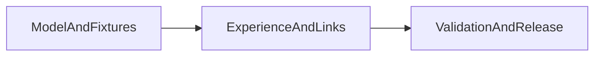

# Four-outcome prescription system

## §0 Plan metadata
- Profile: standard
- Mode: feature
- Stack: Next.js 16.3.3 App Router, React 19, TypeScript 5.9, Node test runner, Playwright
- Base branch: `main`
- Feature branch: none; implementation remains scoped to the current demo worktree
- User commit budget: 3 commits
- Delivery: Cursor plan
- Supersedes: the earlier lite draft at this path
- Authority: [PLAYBOOK.md](D:/projects/STAMPED/L1-L6/L6/experience-integration/PLAYBOOK.md) and [Stamped_Master_Document(1).md](D:/projects/STAMPED/L1-L6/L6/experience-integration/Stamped_Master_Document(1).md)
- Scope authority: `demo/` and its tests only; no platform contract, BFF, live API, or policy-document changes
- Estimated commits: 3
- Lead: primary agent owns implementation, validation, commit, push, and deploy

## §1 North star and scope boundary

### Objective
Make the demo present every prescription, alarm, and evidence record through Stamped’s four company outcomes—Dynamic production planning, Quality & yield, Energy & waste, and Uptime—while showing the value signal that actually fits the decision rather than forcing every card into INR/month.

### Deliverables
- A shared typed outcome and mixed-value model in [demo/src/lib/types.ts](D:/projects/STAMPED/L1-L6/L6/experience-integration/demo/src/lib/types.ts), with legacy financial and workflow fields retained for compatibility.
- Exactly four prescription-page outcome filters, with management classes retained only for Discuss/negotiation behavior.
- All Jaipur, Vinayak, and LNM prescription fixtures assigned to one outcome; the latest Jaipur decision chains remain newest and collectively represent all four outcomes.
- Matching outcome context and domain-specific evidence lineage across prescription, alarm, evidence, Home, Overview, Analyst, detail, and export surfaces.
- Regression coverage for fixture preservation, chain agreement, mixed-value rendering, route aliases, and four-filter behavior.

### Non-goals
- Do not delete or renumber existing alarms, prescriptions, evidence samples, case overrides, historical rows, or deep links.
- Do not remove `decisionClass`, `tradeoff`, ledger INR fields, or bill-verification compatibility fields; these remain internal/behavioral compatibility data.
- Do not change `packages/web`, BFF contracts, `external/`, live APIs, plant control behavior, or source policy documents.
- Do not invent savings guarantees, DISCOM verification, customer claims, or unsupported precision.

### Priority
- P0: four outcomes, latest-first ordering, complete linked chains, claim-safe mixed value labels, mobile-safe filters and detail routes.
- P1: richer domain-specific case narrative and export columns where the existing surface supports them.

## §2 Prerequisites and blockers
- The authority documents are present locally and define the four outcomes and the decision-loop boundary.
- The existing latest chain IDs are stable and must remain stable:
  - `alm_1010` → `rx_9012` → `evd_4415`
  - `alm_1011` → `rx_9013` → `evd_4416`
  - `alm_1012` → `rx_9014` → `evd_4417`
  - `alm_1013` → `rx_9015` → `evd_4418`
  - `alm_1014` → `rx_9016` → `evd_4419`
- No new dependency or schema migration is required. A live API payload that lacks the new optional fields must continue to render through the existing compatibility path.
- Before implementation approval, confirm the current plan’s three-commit budget and preserve unrelated worktree changes.

## §3 Authority and artifact map
- Product truth: [Stamped_Master_Document(1).md](D:/projects/STAMPED/L1-L6/L6/experience-integration/Stamped_Master_Document(1).md) — four outcomes, decision loop, boundaries, and claim-safe language.
- Plant-floor examples: [PLAYBOOK.md](D:/projects/STAMPED/L1-L6/L6/experience-integration/PLAYBOOK.md) — bounded actions, owners, checks, and practical value signals.
- Core types and filtering: [demo/src/lib/types.ts](D:/projects/STAMPED/L1-L6/L6/experience-integration/demo/src/lib/types.ts), [demo/src/lib/prescriptions.ts](D:/projects/STAMPED/L1-L6/L6/experience-integration/demo/src/lib/prescriptions.ts), and [demo/src/lib/prescription-nav.ts](D:/projects/STAMPED/L1-L6/L6/experience-integration/demo/src/lib/prescription-nav.ts).
- Fixture authority: [demo/src/fixtures/demo.ts](D:/projects/STAMPED/L1-L6/L6/experience-integration/demo/src/fixtures/demo.ts), [demo/src/fixtures/evidence-samples.ts](D:/projects/STAMPED/L1-L6/L6/experience-integration/demo/src/fixtures/evidence-samples.ts), and [demo/src/fixtures/prescription-case-details.ts](D:/projects/STAMPED/L1-L6/L6/experience-integration/demo/src/fixtures/prescription-case-details.ts).
- Evidence assembly: [demo/src/lib/evidence.ts](D:/projects/STAMPED/L1-L6/L6/experience-integration/demo/src/lib/evidence.ts) and [demo/src/lib/demo-data.ts](D:/projects/STAMPED/L1-L6/L6/experience-integration/demo/src/lib/demo-data.ts).
- Main experience surfaces: [demo/src/components/prescriptions/PrescriptionQueue.tsx](D:/projects/STAMPED/L1-L6/L6/experience-integration/demo/src/components/prescriptions/PrescriptionQueue.tsx), [demo/src/components/prescriptions/PrescriptionDecisionCard.tsx](D:/projects/STAMPED/L1-L6/L6/experience-integration/demo/src/components/prescriptions/PrescriptionDecisionCard.tsx), [demo/src/components/prescriptions/PrescriptionFullCase.tsx](D:/projects/STAMPED/L1-L6/L6/experience-integration/demo/src/components/prescriptions/PrescriptionFullCase.tsx), alarm/evidence components, and Home/Overview/Analyst/Reports consumers.

## §7 Phase map and dependencies

- Phase A — model, outcome facets, and fixture alignment. Depends only on the approved plan. Exit: typecheck plus focused model/chain tests.
- Phase B — mixed-value presentation and alarm/evidence propagation. Depends on Phase A. Exit: focused tests plus a production build.
- Phase C — full regression, browser walkthrough, documentation note, commit, push, and production deployment. Depends on Phase B.

## §9 Commit matrix

User commit budget: 3. One row equals one conventional commit; tests belong in the commit that needs them.

1. `feat(demo): model four plant decision outcomes`
   - Change the outcome union, value-signal shape, optional alarm/evidence outcome fields, outcome facet parsing, and deterministic fallback sorting.
   - Reclassify all existing fixture rows without deleting records. Keep the five latest chains first and make their actions/evidence credible against the playbook; add a linked row only if four-outcome coverage cannot be achieved honestly by rewording existing records.
   - Preserve `impactInrPerMonth`, ledger fields, `decisionClass`, `tradeoff`, and legacy `class=` URL compatibility.
   - Add focused tests for one-outcome-per-prescription, four-outcome coverage, latest ordering, and stable chain IDs.
   - Gate: `cd demo; npx -y pnpm@11.15.1 typecheck` and focused Node tests.

2. `feat(demo): align decision surfaces to plant outcomes`
   - Replace Maintenance/Management page facets with exactly four outcome filters in [demo/src/components/prescriptions/PrescriptionQueue.tsx](D:/projects/STAMPED/L1-L6/L6/experience-integration/demo/src/components/prescriptions/PrescriptionQueue.tsx), while keeping management negotiation in [demo/src/components/prescriptions/DiscussPanel.tsx](D:/projects/STAMPED/L1-L6/L6/experience-integration/demo/src/components/prescriptions/DiscussPanel.tsx).
   - Render the record’s primary value signal—protected dispatch slot, planned hours, quality guard, kWh/event, idle minutes, or another evidence-backed unit—before optional modeled INR.
   - Update prescription cards, full cases, Home, Overview, Analyst, Reports/export, alarm console/full case, evidence index/detail, and evidence assembly. Remove MD-only hard-coded lineage from non-MD chains.
   - Preserve canonical `evd_44xx`, `evd_<rxId>`, and `?rxId=` routes, with outcome agreement visible at each linked surface.
   - Gate: focused tests and `cd demo; npx -y pnpm@11.15.1 build`.

3. `test(demo): validate four-outcome decision chains`
   - Extend unit tests and Playwright journeys for all four filters, non-empty results, latest-first records, mixed value labels, alarm/Rx/evidence agreement, legacy records, route aliases, and no case-unavailable states.
   - Run lint/error checks for edited files, inspect staged paths and `git diff --check`, and record a short phase note.
   - After all gates pass, push `main` and deploy with `cd demo; vercel --prod --yes`.
   - Gate: the complete §10 and §16 checklist.

## §10 Test and CI strategy

- Fast: `cd demo; npx -y pnpm@11.15.1 typecheck`; `cd demo; npx -y pnpm@11.15.1 test`; targeted tests for prescriptions, latest fixtures, evidence, alarms, and formatting.
- Medium: `cd demo; npx -y pnpm@11.15.1 build`; verify all route data loads through the demo adapter and no optional outcome field breaks the live-compatible type path.
- Slow/UI: `cd demo; npx -y pnpm@11.15.1 test:e2e`; browser-check `/prescriptions`, `/`, `/overview`, `/alarms`, `/evidence`, `/reports`, and every latest alarm/Rx/evidence route at desktop and mobile widths.
- Test locations: existing `demo/tests/*.test.ts` plus focused additions beside the current fixture-chain assertions; extend `demo/e2e/ops-journeys.spec.ts` only for journeys that cannot be proven by unit tests.
- Contract-first rule: compatibility fields remain in place while the new outcome/value fields are optional at the boundary.

## §11 Research log and decisions

- Four outcomes: use the exact product outcomes from the master document, with UI copy aligned to the playbook’s “dynamic production planning” wording.
- Value display: choose a typed primary signal per prescription and retain INR only as an optional modeled/ledger-compatible effect. This follows the master document’s ban on invented currency precision.
- Outcome ownership: one primary outcome per decision card; secondary effects such as cost, flow, energy, or time are tags/signals, not additional categories.
- Management behavior: retain `decisionClass` and trade-off negotiation because the current product behavior depends on them; remove only their use as queue category filters.
- Evidence truth: derive evidence labels and lineage from the linked sample/outcome instead of reusing the current MD coincidence pack for every alarm.
- Latest behavior: preserve existing timestamp-based newest-first ordering and assert that older records remain searchable and resolvable.
- Deep links: preserve both canonical evidence IDs and existing aliases because current console, queue, and evidence routes use different shapes.

## §16 Exit criteria

### P0
- [ ] The prescription page shows exactly four outcome filters: Dynamic production planning, Quality & yield, Energy & waste, and Uptime; every filter returns at least one record.
- [ ] Every prescription has exactly one primary outcome; all latest alarm/Rx/evidence chains share the same outcome and remain newest-first.
- [ ] Cards and summaries lead with the appropriate operating value signal; INR remains only where it is an honest optional modeled or ledger field.
- [ ] Home, Overview, Analyst, Reports, alarms, evidence, detail, and export surfaces show matching outcome context without broken links or case-unavailable states.
- [ ] Existing historical records, evidence, IDs, aliases, Discuss/negotiation behavior, and claim badges remain intact.
- [ ] Typecheck, tests, build, E2E, browser checks, diff checks, and secret/path review pass.

### P1
- [ ] Domain-specific case tables and evidence narratives are polished for every latest chain.
- [ ] Additional mixed-value export columns are available without removing existing financial columns.

## §18 Execution protocol
1. Wait for approval of this standard plan; do not edit demo code before approval.
2. Protect unrelated worktree changes and keep the scope limited to `demo/`.
3. Execute Phase A, then Phase B, then Phase C. Each phase must pass its gate before its commit.
4. Keep one writer per file, preserve IDs and aliases, and apply ponytail before every code edit.
5. Run §10 and §16 validation, write the phase note, then push and deploy only after the user-approved release step.

## §19 Execution graph
`N/A — graph-engineering / graph-of-loops not requested`

## Open questions
- None blocking. Default implementation keeps all existing IDs and records, reworks weak latest narratives where needed, and adds a new linked record only if that is the honest way to represent all four outcomes.

## Approval
**Mode:** feature  
Plan ready for review. Approve to begin Phase A.