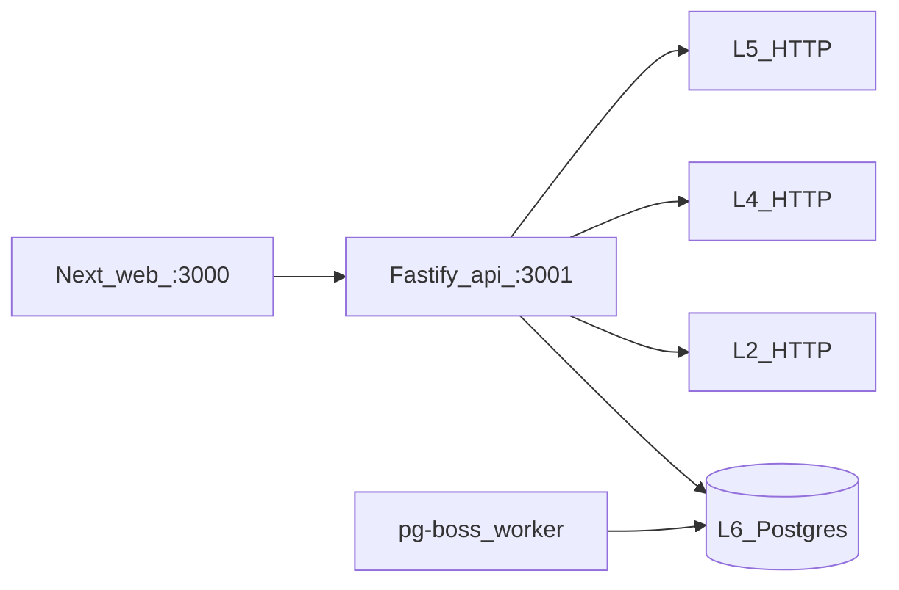

# experience-integration — Stamped L6 Experience & Integration

> Full internals (every package, file map, how the repo runs): [Extensive README](docs/EXTENSIVE.md)

> Customer-facing ops control room for plant energy teams. It is not L3 detection, L5 workflow truth, L4 RAG, or a DISCOM bill verifier. Primary interface: Next.js Forge app (`packages/web` on `:3000`) talking only to the Fastify BFF (`packages/api` on `:3001`). The browser never holds upstream secrets.

**Runtime:** Node ≥22.14 (`pnpm@11.15.1`) · Next.js · Fastify · PostgreSQL · pg-boss worker.  
**Platform pin:** `external/` → stamped-external **v2026.08.05.1** · contracts **0.11.2**

---

## TL;DR

- BFF is the **trust boundary**: L2 / L4 / L5 keys stay on the server.
- Customer “verified” in Auto ops means **`ops_confirmed`** (telemetry). Bill-verified requires bill line refs (`sanitizeClaimStatus`).
- **Fixture Auto** keeps demos and CI green when upstream gates are off or siblings are down.
- **Redis is forbidden** through this delivery; jobs use pg-boss on Postgres.
- **`L2_DATABASE_URL` is forbidden.** L2 is HTTP only.
- Validate with `pnpm validate` (wraps `scripts/validate.sh`).

---

## Table of contents

- [1. Vision](#1-vision)
- [2. Ideas worth understanding](#2-ideas-worth-understanding)
- [3. How it works](#3-how-it-works)
- [4. Quickstart](#4-quickstart)
- [5. Configuration](#5-configuration)
- [6. Further reading](#6-further-reading)
- [7. Future advancements](#7-future-advancements)

## 1. Vision

### What it is

Stamped **Layer 6**. Operators, supervisors, plant heads, energy managers, sustainability, CFO, and admins triage alarms and prescriptions, read claim-safe savings, investigate energy, and export packs. L5 owns workflow truth; L4 owns analyst runtime; L2 owns telemetry and ledger series. L6 **adapts** those HTTP APIs into Forge screens and a scoped public `/v1`.

### What it is not

| Out of scope | Why |
|--------------|-----|
| L3 rulepacks / detectors | Sibling L3 repos |
| L5 SoT for alarms/Rx | L5; L6 projects dual labels |
| L4 LangGraph / Path H | L4; L6 is the shell |
| Direct Timescale / OT writes | Never `L2_DATABASE_URL`; never SCADA |
| Redis job bus | pg-boss on Postgres only |
| Invented bill-verified savings | `sanitizeClaimStatus` strips forged `verified` |

## 2. Ideas worth understanding

### 2.1 BFF as trust boundary

**The problem.** If the browser called L5 with `stk_dev_bootstrap_key`, every operator laptop would hold plant-control credentials. XSS would become an upstream incident.

**How it works.** `packages/web` sends cookie sessions to `NEXT_PUBLIC_BFF_URL` (`packages/web/src/lib/bff.ts`). Only `packages/api` holds `L5_AUTH_TOKEN`, `L2_SERVICE_KEY`, and L4 tokens (`packages/api/src/config.ts`). Upstream clients live under `packages/api/src/upstream/`. Public `/v1` uses hashed `stk_` keys, not browser cookies.

**Like.** A hotel front desk: guests never get the master key to the plant wing; the desk clerk opens the right door.

**Limits.** The BFF is still a high-value target — session cookies, CORS `WEB_ORIGIN`, and rate limits matter. Fixture Auto can make screens look live without L5; that is intentional, not a leak of OT.

**Read next.** This boundary is local to `packages/api/src/config.ts` and ADR-022 in `external/`. No extra public essay; the code is the source.

### 2.2 Ops-confirmed vs bill-verified

**The problem.** A green “verified” chip next to rupees will be read as “the utility bill agrees.” Telemetry clearance is not that.

**How it works.** `sanitizeClaimStatus` in `packages/web/src/lib/ledger.ts` demotes `verificationStatus === "verified"` to `ops_confirmed` unless `billLineRefs` is non-empty. Contracts enums and `claimBadgeLabel` in `packages/contracts/src/mappings.ts` keep the same vocabulary. L5 already sends `ops_label` / `bill_label`; L6 must not collapse them.

**Like.** Two different stamps: shop-floor sign-off vs accounts matching the invoice. Forging the second stamp from the first is the bug this function exists to stop.

**Limits.** Until a live bill path fills `billLineRefs`, Auto ops never shows bill-verified. Do not “helpfully” relabel ops as verified in UI copy.

**Read next.** Claim wording is local to `ledger.ts` + `packages/contracts`. Platform intent lives in ADR-020 under `external/`. [IPMVP](https://www.ipmvp.org/) is the formal M&V discipline L6 refuses to fake.

### 2.3 Fixture Auto

**The problem.** CI and design review cannot depend on L2/L4/L5 being up. Blocking the UI on siblings would freeze the whole program.

**How it works.** Feature gates (`L5_FEATURE_ALARM_*`, `L4_LIVE`, `L2_FEATURE_*`) default off for several mutating paths. `USE_FIXTURES` or failed upstream HTTP falls back to in-memory stores (`createFixtureAlarmStore`, prescription fixture in `packages/api/src/alarms/service.ts` and `packages/api/src/prescriptions/service.ts`). The web Jaipur Works demo in `packages/web/src/fixtures/demo.ts` can render every Forge screen with `pnpm --filter @stamped/l6-web dev` and no API.

**Like.** A flight simulator: the cockpit looks real so you can practice the checklist; it is not connected to a live aircraft until you flip the gates.

**Limits.** Fixture data is not plant truth. Live gates must be flipped independently. Do not screenshot Auto and call it M&V.

**Read next.** Fixture stores are local unpublished. Webhook *idea*: [Webhook (Wikipedia)](https://en.wikipedia.org/wiki/Webhook) — L6 also *receives* L5 callbacks on the BFF, separate from UI fixtures.

### 2.4 RBAC matrix

**The problem.** Better Auth `user.role` is not plant membership. A CFO must not ack alarms; an operator must not mint API keys.

**How it works.** `packages/api/src/authz/matrix.ts` maps seven roles (`operator`, `supervisor`, `plant_head`, `energy_manager`, `sustainability`, `cfo`, `admin`) to route and action permissions. Unknown role/permission **fail closed**. Web nav in `packages/web/src/lib/navigation.ts` mirrors route permissions. Plant membership is separate from the auth user row.

**Like.** A factory badge that opens some doors and not others — the badge printer (Better Auth) is not the door list (matrix).

**Limits.** Entra SSO, when enabled, is identity only; L6 membership remains authorization truth (`packages/api/src/auth/entra.ts`). Matrix drift between web and API is a real risk — change both.

**Read next.** The matrix is local to `packages/api/src/authz/matrix.ts`. No external write-up yet.

## 3. How it works



Browser → BFF (cookie). BFF checks the matrix, then live upstream or Fixture Auto. Postgres holds L6 identity, membership, audit, events, jobs, integrations — not a replica of L5 domain. Worker runs pg-boss queues on the same database.

## 4. Quickstart

### Prerequisites

- Node.js **≥ 22.14** (see `.nvmrc`)
- Corepack / pnpm **11.15.1** (`packageManager` in root `package.json`)
- Git submodules; optional Docker

### Install and validate

```bash
git submodule update --init --recursive
corepack enable
pnpm install
cp .env.example .env
pnpm validate
```

### Run

**UI-only (Jaipur fixtures, no API):**

```bash
pnpm --filter @stamped/l6-web dev
# http://localhost:3000
```

**Full stack:**

```bash
docker compose -f infra/docker-compose.yml up
# web :3000 · api :3001 · postgres :5432 · mailpit UI :8025
```

Without Docker: set `DATABASE_URL`, then `pnpm --filter @stamped/l6-api db:migrate`, `pnpm --filter @stamped/l6-api dev`, `pnpm --filter @stamped/l6-web dev`.

## 5. Configuration

Copy [`.env.example`](.env.example) → `.env`. Never commit secrets. **Never set `L2_DATABASE_URL`.**

| Variable | Newcomer default | Meaning |
|----------|------------------|---------|
| `NEXT_PUBLIC_BFF_URL` | `http://localhost:3001` | Browser → BFF (the only public origin the web needs) |
| `PORT` | `3001` | BFF listen |
| `DATABASE_URL` | local Postgres | L6 DB only |
| `WEB_ORIGIN` | `http://localhost:3000` | CORS |
| `L5_BASE_URL` | `http://127.0.0.1:8080` | L5 HTTP (server-side) |
| `L5_LIVE` / `L6_L5_LIVE` | `true` | Either `false` forces fixture-only BFF |
| `L4_LIVE` | `false` | Live analyst vs fixture |
| `L2_FEATURE_LEDGER` | `false` | Live ledger vs fixture CSV |

Full list: [Extensive README](docs/EXTENSIVE.md#4-configuration).

## 6. Further reading

| Idea | Link | What you will learn |
|------|------|---------------------|
| Claim honesty | [IPMVP](https://www.ipmvp.org/) | Why L6 must not fake bill M&V |
| L5 → L6 events | [Webhook](https://en.wikipedia.org/wiki/Webhook) | Callbacks L6 must verify |
| BFF / matrix / sanitize | local | `packages/api/src/config.ts`, `authz/matrix.ts`, `packages/web/src/lib/ledger.ts` |
| Platform | `external/` | L6 layer spec + handoffs |

## 7. Future advancements

### 7.1 Mumbai CDK pilot

**Why now.** `@stamped/l6-infra` defines `StampedL6PilotMumbai` in `ap-south-1` (`infra/src/bin/app.ts`) but must not auto-apply.  
**What would land.** Human-approved `cdk diff` → deploy per [`docs/runbooks/pilot-ops.md`](docs/runbooks/pilot-ops.md); replace placeholder images with ECR.  
**Done when.** A staging URL serves the BFF + web against RDS without Redis.

### 7.2 Entra / Power BI live

**Why now.** `.env.example` leaves `ENTRA_*` / `POWERBI_*` commented. Identity and push are stubs.  
**What would land.** Live Entra app + Power BI workspace; L6 membership still owns authorization.  
**Done when.** A real tenant signs in and a checkpointed PBI push runs without putting secrets in the browser.

### 7.3 Replace OpenAPI placeholders

**Why now.** `packages/api/src/public/openapi.ts` is a minimal 3.1 document (alarms / events / ledger summaries) — placeholders, not a generated contract.  
**What would land.** Operation schemas aligned with real `/v1` handlers and `contracts/upstream/` snapshots.  
**Done when.** Partner clients can generate types from `/v1/openapi.json` without guessing fields.

### 7.4 Webhook worker completion

**Why now.** pg-boss creates `l6.webhooks.deliver` in `packages/worker/src/boss.ts` but does not register a `work` handler; startup logs only ping + reports queues.  
**What would land.** Idempotent delivery worker with SSRF guards already sketched in `packages/api/src/webhooks/`.  
**Done when.** `POST /api/integrations/webhooks/:id/test` is processed by the worker, not only queued, and CI proves signature + retry.

---

Platform contracts live in `external/`. Do not fork them. Redis and `L2_DATABASE_URL` stay out of this repo.
