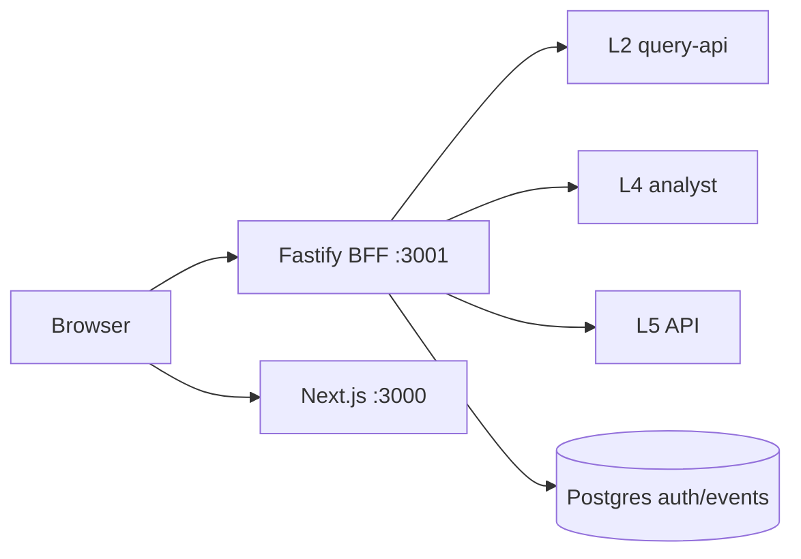

# experience-integration — Stamped L6 Forge (customer experience)

> Full internals (wiring, routes, freshness, package maps): [Extensive README](docs/EXTENSIVE.md)

> Layer 6 is the customer plant experience: Next.js Forge UI + Fastify BFF. The browser never holds upstream keys. It is not L2 SQL, not L5’s internal console, and not a free-form LLM surface. Primary interface: web `:3000` → BFF `:3001`.

**Platform pin:** `external/` → stamped-external **2026.08.21** (`external/VERSION`) · Node ≥22.14 · pnpm 11

---

## TL;DR

- **Browser → BFF only.** Upstream `L2_SERVICE_KEY` / `L5_AUTH_TOKEN` / `L4_AUTH_TOKEN` stay server-side.
- Screens seed from fixtures, then overlay live L2/L4/L5 when gates allow — badges must stay honest.
- **Live badge honesty:** full “Live from L2” only when assets are L2; hybrid → Preview (`resolveLivePageSource`).
- Fixture Auto vs live: `USE_FIXTURES` / `L2_LIVE` / `L5_LIVE` / `L4_LIVE` gates.
- Dual claim labels: **ops-confirmed ≠ bill-verified** (`sanitizeClaimStatus`, `claimBadgeLabel`).
- Shows: Overview, Live plant, Equipment/CNC health, Alarms, Prescriptions, Ask Analyst, evidence/reports (fixtures).

## Table of contents

- [1. Vision](#1-vision)
- [2. Ideas worth understanding](#2-ideas-worth-understanding)
- [3. How it works](#3-how-it-works)
- [4. Quickstart](#4-quickstart)
- [5. Configuration](#5-configuration)
- [6. Further reading](#6-further-reading)
- [7. Future advancements](#7-future-advancements)

## 1. Vision

### What it is

Forge is the **customer-facing plant cockpit**: alarms and prescriptions from L5, live topology/telemetry from L2, Ask Analyst from L4, plus fixture-backed energy/reports when upstream is dark. Auth is session cookies to the BFF (Better Auth); public `/v1` uses hashed `stk_` API keys.

### What it is not

| Out of scope | Owner |
|--------------|--------|
| L5 internal stamped-gate console | `closure-verification` `:8095` |
| Direct Timescale / `L2_DATABASE_URL` | forbidden |
| Finding detectors / Rx compile | L3 / L4 |
| OT write / plant control | never |

## 2. Ideas worth understanding

### 2.1 Browser → BFF → L2 / L4 / L5

**The problem.** Putting service keys in `NEXT_PUBLIC_*` leaks the plant.

**How it works.** Web uses `NEXT_PUBLIC_BFF_URL` + `credentials: "include"` (`packages/web/src/lib/bff.ts`). BFF (`packages/api`) holds upstream tokens (`config.ts`). Empty BFF URL → same-origin / Vercel lean fixtures.

| Screen | Primary data | BFF | Upstream |
|--------|--------------|-----|----------|
| `/live` | L2 overlay + fixtures | `/api/l2/assets`, `/api/l2/measurements` | L2 |
| `/equipment` | L2 assets or preview | `/api/l2/assets` | L2 |
| `/alarms`, `/prescriptions` | Fixtures → L5 | `/api/alarms`, `/api/prescriptions` | L5 |
| `/analyst` | Live stream when enabled | `/api/analyst/*` | L4 |
| `/`, energy, reports, evidence | Fixtures | — | — |

**Like.** A bank teller window — the vault key stays behind the glass.

### 2.2 Freshness and Live badge honesty

**The problem.** Mixing fixture assets with one live series looks “live” and misleads operators.

**How it works.** `DataSource`: `fixture` | `l2` | `l5` | `preview` (`SourceIndicator.tsx`). `resolveLivePageSource()` (`lib/l2-live.ts`): full “Live from L2” only when **assets** are L2; fixture assets + live measurements → **Preview · not live plant data**. `jitter` off only for true L2. Cache-Control: closed historical L2 windows get `private, max-age=60, stale-while-revalidate=300` + ETag; open windows `no-store` (`packages/api/src/http/cache.ts`).

**Like.** A “LIVE” bug on TV that only lights when the truck is actually on site.

### 2.3 Fixture Auto vs live

**The problem.** Demos and CI must run without L2/L5; plants must not silently stay on demo forever without a badge.

**How it works.** Boot gates (`config.ts`): L5 live when `!USE_FIXTURES && L5_LIVE && L6_L5_LIVE`; L4 when `!USE_FIXTURES && L4_LIVE`; L2 when `!USE_FIXTURES && L2_LIVE` + service key. Per-request: alarms/Rx try L5 then fall back to in-memory fixture stores. Mutating alarm features default **off** (`L5_FEATURE_ALARM_ACK`, …). Root `vercel.json` sets `USE_FIXTURES=true` for lean deploy.

Demo plants in `fixtures/demo.ts`: Jaipur, Vinayak, LNM CNC (`plant_lnm_faridabad_1`).

### 2.4 What the UI shows

| Surface | Content |
|---------|---------|
| **Alarms** | Severity, state, summary, related Rx — triage console |
| **Prescriptions** | Lanes needs_review / active / closed; impact ₹/mo; Discuss/negotiation panel |
| **Live** | Load dials, machine map, demand profile, anomaly feed |
| **Equipment** | CNC-centric health tiles from L2 graph or fixture preview |
| **Ask Analyst** | Saved investigations + L4 streaming when enabled |
| **Evidence / reports / energy** | Fixture-backed for demos |

### 2.5 Dual claim labels

**The problem.** Showing “verified” without bill line refs invents M&V.

**How it works.** `sanitizeClaimStatus()` demotes bare `verified` → `ops_confirmed` unless `billLineRefs` non-empty (`lib/ledger.ts`). Badges: “Ops-confirmed”, “Modeled — not bill-verified”, reserved “Bill-verified” (`packages/contracts` `claimBadgeLabel`). Public `/v1/ledger` returns ops_confirmed + note. Aligns with ADR-020.

**Like.** Two stamps on a packing slip — warehouse vs accounts.

### 2.6 Public `/v1`, rate limits, pg-boss

Public routes: Bearer `stk_` keys, scopes in `public/keys.ts`. **Note:** `/v1/alarms` and `/v1/ledger` are **fixture** lists today (not live L5). Rate limits: global BFF 300/min; `/v1/*` 60/min. Worker queues: `l6.fixture.ping`, `l6.reports.generate`; `l6.webhooks.deliver` queue exists **without** a `work` handler yet (Postgres `pgboss`, no Redis).

## 3. How it works



Hide L5 `pending_stamped_review` / `withheld` from customer lanes (L6 responsibility per L5 contract).

## 4. Quickstart

```bash
git clone --recurse-submodules https://github.com/Stamped-Energy/experience-integration.git
cd experience-integration
pnpm install
pnpm validate
# UI-only fixtures (no API):
pnpm --filter @stamped/l6-web dev
# Full local stack:
docker compose -f infra/docker-compose.yml up
```

## 5. Configuration

| Variable | Role |
|----------|------|
| `NEXT_PUBLIC_BFF_URL` | Browser → BFF (omit for same-origin / lean Vercel) |
| `USE_FIXTURES` | Fixture-first boot |
| `L2_LIVE` / `L2_SERVICE_KEY` / `L2_BASE_URL` | Live L2 via BFF |
| `L5_LIVE` / `L6_L5_LIVE` / `L5_AUTH_TOKEN` | Live alarms/Rx |
| `L4_LIVE` / `L4_AUTH_TOKEN` | Ask Analyst |
| Better Auth secrets | Session |

**Forbidden:** `L2_DATABASE_URL`. Full table: [docs/EXTENSIVE.md](docs/EXTENSIVE.md).

## 6. Further reading

| Doc | Why |
|-----|-----|
| [`docs/EXTENSIVE.md`](docs/EXTENSIVE.md) | Route map, deploy, file maps |
| [`docs/deploy/vercel-fixtures.md`](docs/deploy/vercel-fixtures.md) | H0 lean |
| [`deploy/README.md`](deploy/README.md) | Phase H AWS |
| `external/technical/layers/l4-l6/L6-experience-and-integration.md` | Platform spec |

## 7. Future advancements

### 7.1 Mumbai CDK beyond stub

**Why now.** `infra` CDK is a pilot stub — do not auto-apply. **Done when.** Documented apply path with rollback matches `deploy/README.md`.

### 7.2 Live public `/v1` alarms/ledger

**Why now.** Public routes are fixtures. **Done when.** Scoped live L5 projection without leaking internal statuses.

### 7.3 Webhook worker handler

**Why now.** `l6.webhooks.deliver` queue has no `work` handler. **Done when.** Signed delivery jobs process end-to-end.

### 7.4 OpenAPI beyond placeholder

**Why now.** `/v1/openapi.json` is minimal. **Done when.** Published paths match implemented public routes.
