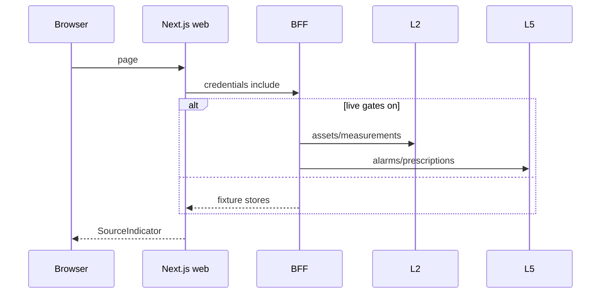

# experience-integration — extensive internals

Companion to the main [README](../README.md). Product wiring and honesty rules first; package file maps later. Do not invent paths.

**Pin:** `external/VERSION` → **2026.08.21**. Runtime: Node ≥22.14, pnpm 11.15.x.

## Table of contents

- [1. Domain concepts — UI wiring](#1-domain-concepts--ui-wiring)
- [2. End-to-end flows](#2-end-to-end-flows)
- [3. Interfaces — route map](#3-interfaces--route-map)
- [4. Novelty and honesty posture](#4-novelty-and-honesty-posture)
- [5. How this repository runs](#5-how-this-repository-runs)
- [6. Package map](#6-package-map)
- [7. Packages](#7-packages)
- [8. Configuration](#8-configuration)
- [9. Tests and CI](#9-tests-and-ci)
- [10. Further reading](#10-further-reading)
- [11. Future advancements](#11-future-advancements)

## 1. Domain concepts — UI wiring

### 1.1 Trust boundary

Browser → Fastify BFF only. Keys: `L5_AUTH_TOKEN`, `L2_SERVICE_KEY`, `L4_AUTH_TOKEN` in `packages/api/src/config.ts`. Web: `bffUrl()` + cookie sessions. Public `/v1`: hashed `stk_` keys (`public/keys.ts`).

### 1.2 Fixture-first overlay

Screens seed `packages/web/src/fixtures/demo.ts` (and machine-health fixtures), then upgrade `DataSource` when BFF returns `l2` / `l5`.

### 1.3 Live badge honesty

| Indicator | Meaning |
|-----------|---------|
| Demo fixture | Fixture path |
| Live from L2 | Assets (and page source) from L2 |
| Live from L5 | Alarms/Rx from L5 |
| Preview · not live plant data | Hybrid / incomplete live |

`resolveLivePageSource()` in `packages/web/src/lib/l2-live.ts`. Equipment preview banner when not L2.

### 1.4 Dual claims

`sanitizeClaimStatus` / `CLAIM_BUCKETS` (`web/src/lib/ledger.ts`); `claimBadgeLabel` / `dualClaimLabels` in contracts + BFF mappings. Never promote `verified` without bill line refs.

### 1.5 Freshness / cache

Closed historical L2 measurements: `private, max-age=60, stale-while-revalidate=300` + weak ETag (`api/src/http/cache.ts`). Open windows: `no-store`. Analyst stream: `no-cache`. Tests: `packages/api/tests/cache-headers.test.ts`.

## 2. End-to-end flows



L5 event poll (live): ~30s for demo org/plant in `api/src/index.ts`.

## 3. Interfaces — route map

### 3.1 Web (`packages/web/src/app/`)

`/`, `/live`, `/energy`, `/equipment`, `/alarms`, `/alarms/[id]`, `/prescriptions`, `/prescriptions/[id]`, `/plant-map`, `/reports`, `/intensity`, `/analyst`, `/tools`, `/evidence`, `/settings/*`.

### 3.2 BFF session API

Health, `/api/meta`, `/api/auth/*`, `/api/me`, plants, alarms (+ actions), prescriptions (+ negotiation), `/api/l2/*`, `/api/analyst/*`, `/api/events/stream`, exports, reports, integrations, admin, telemetry.

### 3.3 Public `/v1`

| Path | Scope | Source today |
|------|-------|--------------|
| `/v1/openapi.json` | — | Placeholder |
| `/v1/alarms` | `alarms:read` | **Fixture** |
| `/v1/events` | `events:read` | `l5Events` table |
| `/v1/ledger` | `ledger:read` | **Fixture** ops_confirmed |

### 3.4 Rate limits

Global 300/min; `/v1/*` 60/min; telemetry POST 60/min (`@fastify/rate-limit`).

### 3.5 pg-boss

Queues: `l6.fixture.ping`, `l6.reports.generate`, `l6.webhooks.deliver` (**no work handler yet**). Schema `pgboss` on Postgres — no Redis.

## 4. Novelty and honesty posture

- BFF trust boundary with fixture-first demos.
- Explicit Live vs Preview rules (not “any 200 ⇒ live”).
- Dual claim sanitization aligned with ADR-020.
- Customer must not treat L5 withhold / pending_stamped_review as normal lanes.
- RBAC matrix mirrored web + API (`navigation.ts`, `authz/matrix.ts`).
- Lean Vercel fixtures deploy without BFF.

## 5. How this repository runs

| Mode | How |
|------|-----|
| UI-only | `pnpm --filter @stamped/l6-web dev` |
| Full compose | `infra/docker-compose.yml` — web 3000, api 3001, postgres, mailpit, worker |
| Validate | `pnpm validate` → `scripts/validate.sh` |
| Vercel lean | `USE_FIXTURES=true`, omit BFF URL |

## 6. Package map

| Package | Path | Role |
|---------|------|------|
| web | `packages/web` | Next.js Forge UI |
| api | `packages/api` | Fastify BFF |
| contracts | `packages/contracts` | Zod enums, claim badges |
| worker | `packages/worker` | pg-boss jobs |
| infra / deploy | `infra/`, `deploy/` | Compose, AWS notes, Vercel |

## 7. Packages

### 7.1 `@stamped/l6-web`

**What it is for.** Customer UI.

| Area | Path | Why |
|------|------|-----|
| Screens | `src/app/**` | Routes |
| Live honesty | `lib/l2-live.ts`, `hooks/useL2Data.ts` | Overlay + source |
| Claims | `lib/ledger.ts` | Sanitize verified |
| Fixtures | `fixtures/demo.ts`, `machine-health.ts` | Demo plants |
| Indicators | `components/ui/SourceIndicator.tsx` | Badge copy |
| Alarms / Rx / Live / Equipment / Analyst | `components/**` | Feature UI |

### 7.2 `@stamped/l6-api`

**What it is for.** Session BFF + public `/v1` + upstream clients.

| Area | Path | Why |
|------|------|-----|
| Config / gates | `src/config.ts`, `index.ts` | Fixture vs live |
| L2 / L4 / L5 clients | `src/upstream/**` | HTTP only |
| Alarms / Rx services | `src/alarms`, `src/prescriptions` | Live + fixture fallback |
| Cache | `src/http/cache.ts` | Freshness headers |
| Public | `src/public/**` | stk_ keys, rate limit |
| Authz | `src/authz/matrix.ts` | RBAC |

### 7.3 `@stamped/l6-contracts`

Shared mappings: `claimBadgeLabel`, `workflowStatusToLane`, Zod enums.

### 7.4 Worker

`packages/worker/src/boss.ts` — queue registration; webhook deliver unfinished.

## 8. Configuration

| Variable | Role |
|----------|------|
| `USE_FIXTURES` | Fixture boot |
| `L2_LIVE`, `L2_BASE_URL`, `L2_SERVICE_KEY` | Live L2 |
| `L5_LIVE`, `L6_L5_LIVE`, `L5_AUTH_TOKEN` | Live L5 |
| `L4_LIVE`, `L4_AUTH_TOKEN` | Analyst |
| `L5_FEATURE_ALARM_*` | Mutating alarm gates (default off) |
| `NEXT_PUBLIC_BFF_URL` | Browser BFF |
| Auth / DB URLs | Sessions, events, pg-boss |

**Forbidden:** `L2_DATABASE_URL`. See `.env.example`.

## 9. Tests and CI

```bash
pnpm validate
# Includes unit tests, cache-header checks, fixture CNC smoke
```

Notable: `packages/web/tests/l2-live*.test.ts`, `packages/api/tests/cache-headers.test.ts`.

## 10. Further reading

- [`docs/deploy/vercel-fixtures.md`](deploy/vercel-fixtures.md)
- [`deploy/README.md`](../deploy/README.md)
- [`docs/PHASE_N_VALIDATION.md`](PHASE_N_VALIDATION.md)
- Platform L6 spec under `external/technical/layers/l4-l6/`

## 11. Future advancements

### 11.1 CDK apply path

**Done when.** Mumbai pilot is apply-documented with rollback; stub not auto-applied.

### 11.2 Live public API projections

**Done when.** `/v1/alarms` and `/v1/ledger` can be live-scoped without leaking internal Rx statuses.

### 11.3 Webhook work handler

**Done when.** `l6.webhooks.deliver` processes signed jobs.

### 11.4 Real OpenAPI

**Done when.** `/v1/openapi.json` matches implemented public routes.
