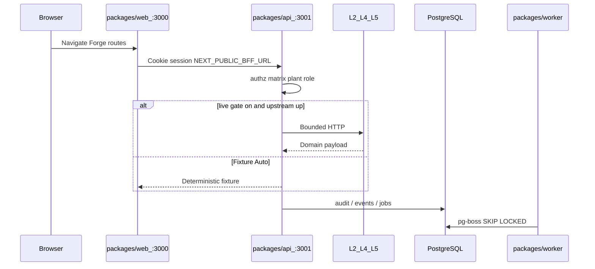

# experience-integration — extensive internals

Companion to the main [README](../README.md). How the repo runs, every first-party package, and why the important files exist. Do not invent paths.

pnpm workspace `stamped-l6` **0.1.0**. Workspaces: `packages/*` and `infra` (`pnpm-workspace.yaml`).

**Platform pin:** `external/` → stamped-external **v2026.08.05.1** · contracts **0.11.2**

## Table of contents

- [1. How this repository runs](#1-how-this-repository-runs)
- [2. Package map](#2-package-map)
- [3. Packages](#3-packages)
- [4. Configuration](#4-configuration)
- [5. Tests and CI](#5-tests-and-ci)
- [6. Ideas worth understanding](#6-ideas-worth-understanding)
- [7. Further reading](#7-further-reading)
- [8. Future advancements](#8-future-advancements)

## 1. How this repository runs



**Web-only:** `pnpm --filter @stamped/l6-web dev` — Jaipur fixtures, no BFF, no secrets.

**BFF boot** (`packages/api/src/index.ts`): requires `DATABASE_URL`, constructs Better Auth, optionally `L5WorkflowClient` when `L5_LIVE && L6_L5_LIVE && !USE_FIXTURES`, polls L5 events every 30s for `org_acme` / `plant_vinayak_1`.

**Compose:** `infra/docker-compose.yml` — postgres `:5432`, api `:3001`, worker, web `:3000`, mailpit `:1025`/`:8025`.

**Generated / vendor (one line each):** `node_modules/`, `.next/`, `external/` submodule, Playwright/CDK artifacts gitignored. Do not file-list them.

## 2. Package map

| Package | Path | Role | Entry |
|---------|------|------|-------|
| `@stamped/l6-web` | `packages/web` | Forge UI | `pnpm --filter @stamped/l6-web dev` (`:3000`) |
| `@stamped/l6-api` | `packages/api` | Fastify BFF + `/v1` | `pnpm --filter @stamped/l6-api dev` (`:3001`) |
| `@stamped/l6-worker` | `packages/worker` | pg-boss jobs | `pnpm --filter @stamped/l6-worker start` |
| `@stamped/l6-contracts` | `packages/contracts` | Zod + claim/workflow maps | imported by api/web |
| `@stamped/l6-infra` | `infra` | Compose + CDK Mumbai | `docker compose -f infra/docker-compose.yml up`; `cdk synth` |

Root `scripts/validate.sh` is the gate (`pnpm validate`). `contracts/upstream/` holds pinned L2/L4/L5 OpenAPI snapshots — not a runtime package. `external/` is SSOT.

## 3. Packages

### 3.1 `@stamped/l6-web` (`packages/web`)

**What it is for.** Customer Forge UI. Cookie calls to the BFF. **Must not** embed L5/L2 secrets.

**How it is used.** `next dev` / `next start` on `:3000`. `NEXT_PUBLIC_BFF_URL` is the only browser-visible backend origin.

**How it works.** App Router pages compose fixtures (`src/fixtures/demo.ts`) and/or BFF JSON. Claim chips go through `sanitizeClaimStatus`. Nav permissions mirror the API matrix.

#### File map

| File | Why it is here | What it does |
|------|----------------|--------------|
| `packages/web/package.json` | Workspace package | `@stamped/l6-web` scripts: dev/build/test/e2e |
| `packages/web/src/app/layout.tsx` | Root chrome | App shell |
| `packages/web/src/app/page.tsx` | Today / Overview | Decision strip |
| `packages/web/src/app/live/page.tsx` | Live | Live ops view |
| `packages/web/src/app/alarms/page.tsx` | Alarm list | EMS console |
| `packages/web/src/app/alarms/[id]/page.tsx` | Alarm detail | Evidence hop |
| `packages/web/src/app/prescriptions/page.tsx` | Rx queue | Triage |
| `packages/web/src/app/prescriptions/[id]/page.tsx` | Rx detail | Full case |
| `packages/web/src/app/evidence/page.tsx` | Evidence index | Proof list |
| `packages/web/src/app/evidence/[id]/page.tsx` | Evidence detail | One bundle |
| `packages/web/src/app/analyst/page.tsx` | Mode B | Investigation workspace |
| `packages/web/src/app/energy/page.tsx` | Energy | Demand / consumers |
| `packages/web/src/app/equipment/page.tsx` | Machine health | Load dials |
| `packages/web/src/app/intensity/page.tsx` | Intensity | TOD/MD/SEC |
| `packages/web/src/app/reports/page.tsx` | Export Centre | Ledger + packs |
| `packages/web/src/app/plant-map/page.tsx` | Plant map | Spatial view |
| `packages/web/src/app/tools/page.tsx` | Tools | Operator tools |
| `packages/web/src/app/settings/integrations/page.tsx` | Integrations | Keys, webhooks, Entra/PBI UI |
| `packages/web/src/app/settings/admin/page.tsx` | Admin | Members + audit |
| `packages/web/src/app/settings/assignments/page.tsx` | Assignments | Role assignment UI |
| `packages/web/src/lib/bff.ts` | Trust boundary | Browser → BFF URL only |
| `packages/web/src/lib/ledger.ts` | Claim safety | `sanitizeClaimStatus` |
| `packages/web/src/lib/navigation.ts` | RBAC nav | Route permissions per role |
| `packages/web/src/lib/prescriptions.ts` | Rx helpers | Queue shaping |
| `packages/web/src/fixtures/demo.ts` | Jaipur SoT | Coherent demo plant |
| `packages/web/playwright.config.ts` | E2E | Chromium desktop + Pixel 5 |
| `packages/web/tests/` | Unit tests | ledger, prescriptions, nav, analytics |

### 3.2 `@stamped/l6-api` (`packages/api`)

**What it is for.** Product BFF: session auth, plant RBAC, upstream adapters, SSE, CSV, public `/v1`. Browser-facing secrets must not appear in JSON.

**How it is used.** `tsx watch src/index.ts` on `HOST`/`PORT` (default `:3001`). Compose service `api`.

**How it works.** `app.ts` registers route modules. Upstream HTTP is bounded (`upstream/http.ts`). Alarms/prescriptions fall back to fixture stores when L5 is gated or down.

#### File map

| File | Why it is here | What it does |
|------|----------------|--------------|
| `packages/api/src/index.ts` | Process entry | Pool, auth, L5 client gate, 30s event poll |
| `packages/api/src/app.ts` | Fastify factory | CORS, rate limit, route registration |
| `packages/api/src/config.ts` | Env schema | Zod env; documents no `L2_DATABASE_URL` |
| `packages/api/src/authz/matrix.ts` | RBAC | Seven roles × permissions; fail closed |
| `packages/api/src/authz/index.ts` | AuthZ helpers | Permission checks |
| `packages/api/src/auth/index.ts` | Better Auth | Sessions; signup disabled |
| `packages/api/src/auth/routes.ts` | Auth HTTP | `/api/auth/*` |
| `packages/api/src/auth/entra.ts` | Optional SSO | Identity only |
| `packages/api/src/upstream/l5/client.ts` | L5 adapter | Workflow HTTP + feature flags |
| `packages/api/src/upstream/l4/client.ts` | L4 adapter | Analyst HTTP / fixture |
| `packages/api/src/upstream/l2/client.ts` | L2 adapter | Query HTTP — never DB URL |
| `packages/api/src/upstream/http.ts` | Bounded fetch | Timeouts / errors |
| `packages/api/src/upstream/mappings.ts` | Wire → product | Canonical maps |
| `packages/api/src/alarms/routes.ts` | Alarm HTTP | List + actions |
| `packages/api/src/alarms/service.ts` | Alarm logic | Live L5 or `createFixtureAlarmStore` |
| `packages/api/src/prescriptions/routes.ts` | Rx HTTP | Queue/detail |
| `packages/api/src/prescriptions/service.ts` | Rx logic | Live or fixture Auto |
| `packages/api/src/public/routes.ts` | Partner `/v1` | API-key reads |
| `packages/api/src/public/openapi.ts` | OpenAPI stub | Placeholder 3.1 document |
| `packages/api/src/public/keys.ts` | `stk_` keys | Hash at rest |
| `packages/api/src/webhooks/service.ts` | Webhook CRUD | Endpoints + deliveries |
| `packages/api/src/webhooks/sign.ts` | Sign | HMAC for outbound |
| `packages/api/src/webhooks/ssrf.ts` | SSRF guard | Block bad destinations |
| `packages/api/src/events/sse.ts` | SSE | Resumable stream |
| `packages/api/src/events/ingest.ts` | L5 cursor | Durable event ingest |
| `packages/api/src/db/schema.ts` | Drizzle schema | L6 tables only |
| `packages/api/src/db/migrate.ts` | Migrations | Apply drizzle SQL |
| `packages/api/drizzle/0000_foundation.sql` … `0007_enterprise.sql` | SQL history | Tenancy, auth, events, keys, webhooks |
| `packages/api/tests/` | API tests | tenancy, prescriptions, mappings, alarms |

### 3.3 `@stamped/l6-worker` (`packages/worker`)

**What it is for.** Background jobs on Postgres via pg-boss. **Redis excluded** (`packages/worker/README.md`, DEC-002).

**How it is used.** Compose `worker`; `pnpm --filter @stamped/l6-worker start`. Shares `DATABASE_URL`.

**How it works.** `boss.ts` creates three queues. `work` handlers exist for `l6.fixture.ping` and `l6.reports.generate` (idempotent accept). `l6.webhooks.deliver` is **created but not consumed** — completion is a future advancement.

#### File map

| File | Why it is here | What it does |
|------|----------------|--------------|
| `packages/worker/src/index.ts` | Process entry | Start/stop; logs ping + reports queues |
| `packages/worker/src/boss.ts` | Queue wiring | `QUEUES`, `createBoss`, `startWorker` |
| `packages/worker/src/config.ts` | Worker env | `DATABASE_URL` |
| `packages/worker/README.md` | Package note | Postgres only; no Redis |
| `packages/worker/package.json` | Workspace package | `@stamped/l6-worker` |

### 3.4 `@stamped/l6-contracts` (`packages/contracts`)

**What it is for.** Shared Zod schemas and display maps. Must not fork `external/contracts` field names.

**How it is used.** API and web import `@stamped/l6-contracts`. Tests: `packages/contracts/tests/`.

**How it works.** Enums for roles, alarm states, verification statuses. `workflowStatusToLane` throws if `withheld` / `pending_stamped_review` reach the customer map. `claimBadgeLabel` keeps ops vs bill copy distinct.

#### File map

| File | Why it is here | What it does |
|------|----------------|--------------|
| `packages/contracts/src/index.ts` | Barrel | Re-exports |
| `packages/contracts/src/enums.ts` | Vocabulary | Roles, alarms, `ops_confirmed` ≠ `verified` |
| `packages/contracts/src/schemas.ts` | Zod | WorkflowEvent + LedgerEntry subsets |
| `packages/contracts/src/mappings.ts` | UI projection | Lanes + claim badges |
| `packages/contracts/tests/mappings.test.ts` | Guards | Customer map must not leak internal statuses |
| `packages/contracts/package.json` | Workspace package | `@stamped/l6-contracts` |

### 3.5 `@stamped/l6-infra` (`infra`)

**What it is for.** Local Compose stack and AWS CDK **definitions** for Mumbai (`ap-south-1`). Not a silent deploy.

**How it is used.** `docker compose -f infra/docker-compose.yml up`. CDK: `pnpm --filter @stamped/l6-infra synth` / tests. Human `cdk diff` before apply ([`docs/runbooks/pilot-ops.md`](runbooks/pilot-ops.md)).

**How it works.** Compose runs node 22.14 images with corepack/pnpm against a bind-mounted repo. CDK stack `StampedL6PilotMumbai` defines VPC, RDS Postgres 16, ECS/ALB, S3, Secrets Manager.

#### File map

| File | Why it is here | What it does |
|------|----------------|--------------|
| `infra/docker-compose.yml` | Local runtime | postgres, api, worker, web, mailpit |
| `infra/src/bin/app.ts` | CDK app | Instantiates `StampedL6PilotMumbai` |
| `infra/src/lib/l6-pilot-stack.ts` | Stack | Pilot topology; no auto-apply |
| `infra/tests/stack.test.ts` | CDK assertions | `pnpm --filter @stamped/l6-infra test` |
| `infra/package.json` | Workspace package | `@stamped/l6-infra` |

## 4. Configuration

[`.env.example`](../.env.example). Parsed in `packages/api/src/config.ts`.

| Variable | Required | Default | Description |
|----------|----------|---------|-------------|
| `NEXT_PUBLIC_BFF_URL` | web | `http://localhost:3001` | Browser BFF origin |
| `HOST` / `PORT` | api | `0.0.0.0` / `3001` | BFF listen |
| `DATABASE_URL` | api/worker | compose Postgres | L6 Postgres only |
| `DIRECT_URL` | migrations | optional | Non-pooler URL |
| `REQUIRE_DATABASE` | api | `false` | Ready check |
| `BETTER_AUTH_SECRET` | auth | dev placeholder | Session signing |
| `BETTER_AUTH_URL` | auth | `http://localhost:3001` | Auth base |
| `WEB_ORIGIN` | CORS | `http://localhost:3000` | Allowlist |
| `SMTP_*` | invites | Mailpit locals | Fake email |
| `L5_BASE_URL` / `L5_TIMEOUT_MS` | upstream | `:8080` / `5000` | L5 HTTP |
| `L5_AUTH_TOKEN` | upstream | commented | `X-API-Key` |
| `L5_LIVE` / `L6_L5_LIVE` | gates | `true` | Either false → fixture-only |
| `USE_FIXTURES` | gates | `false` | Force fixtures |
| `L5_FEATURE_ALARM_ACK` / `ESCALATE` / `UNSILENCE` | gates | `false` | Live mutating alarm routes |
| `L4_BASE_URL` / `L4_LIVE` | upstream | `:8000` / `false` | Analyst |
| `L2_BASE_URL` / `L2_FEATURE_*` | upstream | `:8091` / `false` | Query HTTP |
| `L2_DATABASE_URL` | **forbidden** | — | Must never be set |
| `ENTRA_*` / `POWERBI_*` | optional | commented | Enterprise stubs |

Redis: not a config key. Product decision DEC-002 — do not add Redis for jobs or SSE through this delivery.

## 5. Tests and CI

```bash
pnpm validate                 # scripts/validate.sh
# docs presence, no L2_DATABASE_URL assignment in product src,
# external contract-check, pnpm contracts:upstream, typecheck, test, infra test, build
```

| Layer | Command | Where |
|-------|---------|--------|
| Root gate | `pnpm validate` | `scripts/validate.sh` |
| Web unit | `pnpm --filter @stamped/l6-web test` | `packages/web/tests/` |
| API unit | `pnpm --filter @stamped/l6-api test` | `packages/api/tests/` |
| Contracts | `pnpm --filter @stamped/l6-contracts test` | `packages/contracts/tests/` |
| Infra | `pnpm --filter @stamped/l6-infra test` | `infra/tests/` |
| Playwright | `VALIDATE_E2E=1` or filter `test:e2e` | `packages/web` |
| BFF smoke | `pnpm smoke:bff` | health/ready/meta/openapi/401 |

CI: `.github/workflows/ci.yml` — `quality` (`SKIP_E2E=1 pnpm validate`), `postgres-integration`, `browser-e2e`, `infra`. Node from `.nvmrc` (`22.14.0`).

## 6. Ideas worth understanding

1. **BFF trust boundary** — only `NEXT_PUBLIC_BFF_URL` in the browser; upstream tokens in `config.ts`.
2. **`sanitizeClaimStatus`** — forged `verified` without `billLineRefs` becomes `ops_confirmed`.
3. **Fixture Auto** — gates + in-memory stores so CI/demo do not require live L2/L4/L5.
4. **RBAC matrix** — plant roles ≠ Better Auth user.role; fail closed.

**Read next.** [IPMVP](https://www.ipmvp.org/) (do not fake bill M&V); [Webhook](https://en.wikipedia.org/wiki/Webhook) (L5→L6 and L6 outbound). Matrix and sanitize are unpublished outside this repo.

## 7. Further reading

| Idea | Link | What you will learn |
|------|------|---------------------|
| M&V honesty | [IPMVP](https://www.ipmvp.org/) | Why bill-verified is a different claim |
| Callbacks | [Webhook](https://en.wikipedia.org/wiki/Webhook) | Signing, replay |
| Pilot ops | [`docs/runbooks/pilot-ops.md`](runbooks/pilot-ops.md) | Mumbai CDK human gate |
| Security | [`docs/SECURITY_REVIEW.md`](SECURITY_REVIEW.md) | Review notes |
| Platform | `external/` | L6 layer + handoffs |

PostgreSQL row-level security is **not** how L6 tenancy is enforced today (application matrix + membership tables). Do not assume [Postgres RLS](https://www.postgresql.org/docs/current/ddl-rowsecurity.html) is wired here; that document is background only if you add RLS later.

## 8. Future advancements

### 8.1 Mumbai CDK pilot

**Why now.** `infra/src/lib/l6-pilot-stack.ts` is definitions; [`docs/runbooks/pilot-ops.md`](runbooks/pilot-ops.md) forbids silent deploy.  
**What would land.** Approved `cdk diff`, ECR image, RDS-backed BFF.  
**Done when.** Pilot URL in `ap-south-1` without Redis.

### 8.2 Entra / Power BI live

**Why now.** Commented `ENTRA_*` / `POWERBI_*` in `.env.example`; `auth/entra.ts` and `integrations/powerbi.ts` are stubs.  
**What would land.** Live tenant + workspace; membership remains L6.  
**Done when.** Real SSO + checkpointed PBI push; no secrets in the browser.

### 8.3 Replace OpenAPI placeholders

**Why now.** `packages/api/src/public/openapi.ts` describes `/alarms`, `/events`, `/ledger` at summary level.  
**What would land.** Generated/accurate schemas for `/v1`.  
**Done when.** Partners can codegen without guessing.

### 8.4 Webhook worker completion

**Why now.** `QUEUES.webhooksDeliver` is created in `packages/worker/src/boss.ts` with no `boss.work` handler.  
**What would land.** Idempotent deliverer using `packages/api/src/webhooks/`.  
**Done when.** Test/redrive routes complete via the worker in CI.
