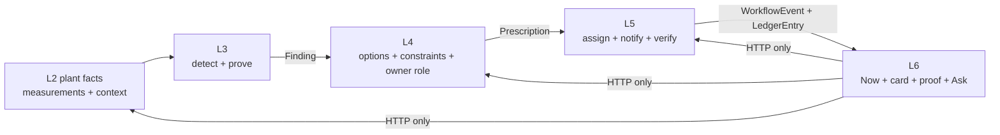

# L3 → L6 build guide

> **Audience:** Engineers updating Stamped L6 Forge.  
> **Purpose:** Explain how a trusted L3 condition becomes a customer-facing L6
> experience, what L6 must preserve, and what L6 must never recompute or
> claim.  
> **Status:** Implementation handoff for the current L6 update.  
> **Product:** Stamped — helps plant teams choose, assign, and verify the next
> operating action across energy, cost, time / throughput, continuity / flow,
> and short-horizon exceptions.

This is a repo-local build guide. Platform contracts and architecture remain
authoritative in `external/`. If this document conflicts with a schema, ADR, or
handoff in `external/`, the platform source wins.

---

## 1. The one-sentence boundary

**L3 detects and proves a plant condition; L4 chooses a bounded operating
action; L5 assigns and verifies it; L6 presents the next action and its proof.**

L6 is not a second detector, calculator, workflow engine, or source of plant
truth.



The customer-facing path is therefore:

```text
L3 Finding
  → L4 DecisionCase / Prescription
  → L5 live workflow and closure
  → L6 BFF projection
  → L6 web view
```

L6 should normally receive a Finding through the L4/L5 projection, not by
calling L3 directly. A direct L3 client would create a second delivery path,
duplicate cards, and bypass L4 constraints and L5 assignment.

---

## 2. Read these sources first

### L6 repository

1. `README.md`
2. `external/handoff/l6/stamped-l6-architecture-handoff.md`
3. `external/handoff/l6/stamped-l6-ui-ux-charter.md`
4. `external/handoff/l6/stamped-l6-build-plan.md`
5. `external/decisions/016-020/ADR-016-l6-bff-runtime-boundary.md`
6. `external/decisions/020-023/ADR-023-l6-ems-and-analyst-context.md`
7. `docs/architecture/layer-interfaces.md`
8. `docs/EXTENSIVE.md`

### L3 repository

1. `../../../L3/intelligence-core/docs/L3_L2_L4_L6_FIELD_MAP.json`
2. `../../../L3/intelligence-core/docs/L3_PILOT_RUNBOOK.md`
3. `../../../L3/intelligence-core/docs/L3_METHODS.md`
4. `../../../L3/intelligence-core/docs/L4_HANDOFF.md`
5. `../../../L3/intelligence-core/src/stamped_l3_core/contracts/finding_v2.py`
6. `../../../L3/intelligence-core/src/stamped_l3_core/delivery.py`

### Platform contracts

These files are the source of truth, not the TypeScript types in this repo:

- `external/contracts/schemas/intelligence/finding.json`
- `external/contracts/schemas/intelligence/prescription.json`
- `external/contracts/schemas/envelope/workflow-event.json`
- `external/contracts/schemas/closure/ledger-entry.json`
- `external/handoff/l5/stamped-l5-architecture-handoff.md`
- `external/technical/l4/15-l3-l4-interface.md`

---

## 3. Current state and compatibility warning

The L3 decision-quality program is complete in the L3 repository, but that
does not mean L6 can immediately consume every L3 shape.

Observed repository state for this handoff:

| Repository | Current platform pin | Practical consequence |
| --- | --- | --- |
| L3 `intelligence-core` | `external/VERSION` = `2026.09.25` | Contains the newer decision-quality substrate and Finding 2.0 candidate |
| L6 `experience-integration` | `external/VERSION` = `2026.08.21` | Its checked-in contract view is still the Finding 1.2.0 / L4 / L5 compatibility surface |

The L6 worktree also has a modified `external` submodule pointer. Treat that
as existing work. Inspect it before committing and do not reset or overwrite
it as part of this update.

### Compatibility rule

Build L6 against the contract version pinned by L6 until the platform pin is
intentionally updated and contract checks pass.

Do not:

- copy the L3 Finding 2.0 schema into L6;
- add a direct L3-to-browser or L3-to-BFF path;
- assume L4 or L5 already exposes every Finding 2.0 field;
- render a `shadow` Finding as a customer action;
- promote a modeled or ops-confirmed amount to “bill-verified”.

Finding 2.0 is currently a candidate/certified-lane shape in L3. The current
production compatibility path remains Finding 1.2.0 until the platform and L4
consumer accept the complete replacement shape.

---

## 4. Ownership model

| Concern | Owner | What L6 does |
| --- | --- | --- |
| Plant truth | L2 | Reads only through the L2 HTTP query API |
| Detection and condition identity | L3 | Displays references; never re-detects |
| Evidence tiers and lineage | L3 | Displays tier/source/freshness honestly |
| INR calculations | L3 calculator, carried through L4 | Displays calculator/rate references; never recalculates |
| Options and trade-offs | L4 | Displays the chosen action and trade-off context |
| Owner role | L4 | Displays the proposed role |
| Person assignment | L5 | Displays the resolved assignee when available |
| Workflow status | L5 | Maps status to a display lane |
| Verification and closure | L5 | Displays events and ledger results |
| Customer UI and accessibility | L6 | Owns interaction, disclosure, empty/error/stale states |
| Analyst retrieval and reasoning | L4 | L6 sends an explicit, removable context envelope |

### Hard ownership rules

1. L6 cannot write to an L2 database.
2. L6 cannot append a savings ledger entry.
3. L6 cannot call an OT or plant-control endpoint.
4. L6 cannot turn a Finding into a Prescription.
5. L6 cannot choose a person from a role placeholder.
6. L6 cannot change the L5 workflow state without the L5 action endpoint.
7. L6 cannot merge separate effect wallets into a new financial claim.
8. L6 cannot expose internal L5 states such as `withheld` or
   `pending_stamped_review` in customer lanes.

---

## 5. Contract chain

### 5.1 L3 Finding → L4

The current production Finding contract in the L6 platform pin is
`schema_version: "1.2.0"`. Its important fields for downstream display are:

| Finding field | Meaning | L6 treatment |
| --- | --- | --- |
| `finding_id` | Stable Finding identity | Preserve as lineage; use in evidence links |
| `org_id`, `plant_id` | Tenant and plant binding | Validate against the active session/plant |
| `category` | Detector category | Use as a label only after an approved display mapping |
| `value_domain` | Energy or equipment-health pillar in the current contract | Render as a domain badge; do not infer a new domain |
| `waste_category` | Current L3 category 1–6 | Render only when present and valid |
| `assets` | Affected assets | Render as affected scope |
| `evidence` | Metric, baseline, actual, window, tags, model/rule refs | Link to proof; never replace with a UI-generated explanation |
| `confidence` | Detector confidence | Render with a defined label; do not treat it as a probability of savings |
| `estimated_monthly_kwh` | Estimated energy effect | Keep separate from INR and other domains |
| `estimated_monthly_inr` | L3 estimated INR | Require `inr_decomposition` references before presenting as priced |
| `inr_decomposition` | Rate/formula/bill-line references | Show provenance and modeled/bill-tied qualifier |
| `ops_clearance` | Machine-evaluable verification plan | Pass through to L5; render the verification boundary and outcome |
| `alarm_hint` | L3 suggestion for L5 alarm creation | Never route or escalate in L6 |
| `dedupe_key` | Stable condition identity for delivery | Preserve for traceability; do not use UI IDs as replacement |

`ops_clearance` is a hard gate for the L5 path. A Finding without it cannot
be treated as a complete customer action.

### 5.2 Finding 2.0 candidate shape

The current L3 candidate model adds decision-quality fields:

```text
schema_version
finding_id
org_id
plant_id
detector_id
detector_version
decision_family_id
domain
condition_key
assets
facts[]
effects[]
verification_plan
constraint_refs_considered[]
lane
dedupe_key
```

This shape is useful for the L6 target view, but it is not a reason to make L6
own the Finding contract. L6 should accept these fields only when they arrive
through an approved upstream contract and L5/L4 preserve them.

Important semantics:

- `lane: "shadow"` means diagnostics/replay only, not a customer card.
- `lane: "l4"` is an intake lane, not proof that L4 emitted a card.
- `condition_key` identifies one physical condition across detector duplicates.
- `effects[]` are separate wallets. They must not be added into one L6 hero
  number.
- Every rupee effect needs a `calculator_ref`.
- `unknown` means unknown, not zero.

### 5.3 L4 Prescription → L5

The canonical `prescription.json` contract is the customer action bridge:

| Prescription field | L6 surface |
| --- | --- |
| `id` | URL, card identity, action idempotency scope |
| `org_id`, `plant_id` | Tenant validation |
| `status` | Map to a display lane; L5 remains the source of truth |
| `priority` | Queue order and urgency label |
| `what` | Primary action statement |
| `why` | Compact explanation |
| `who` | Role/owner placeholder; person comes from L5 |
| `effort` | Effort label |
| `when` | Due/window label |
| `impact` | Separate potential impact and provenance |
| `finding_refs` | L3 lineage links |
| `evidence_refs` | Pre-scoped evidence links |
| `mv_plan` | Verification plan displayed on the proof view |
| `dedupe_key` | Idempotent identity |

L6 must preserve `finding_refs`, `evidence_refs`, `mv_plan`, `impact.formula_id`,
and `impact.rate_ref` even if the compact card only shows a subset.

### 5.4 L5 WorkflowEvent → L6

`WorkflowEvent` is append-only runtime truth for lifecycle and closure. The
L4 `Prescription.status` is not the source of truth for `verified` or
`disputed`.

Use the event stream for:

- alarm raised/acknowledged/cleared;
- prescription transitions;
- escalation and reminders;
- ops verification or regression;
- ledger append acknowledgement;
- negotiation/revision events.

L6 already has an SSE path with `Last-Event-ID` replay. Keep it scoped by
`org_id` and `plant_id`.

### 5.5 L5 LedgerEntry → L6

The ledger is append-only and carries the claim status:

| `verification_status` | Customer wording |
| --- | --- |
| `pending` | Pending |
| `ops_confirmed` | Ops-confirmed |
| `modeled` | Modeled — not bill-verified |
| `disputed` | Disputed |
| `verified` | Bill-verified only when the bill path and bill refs support it |

Never infer `verified` from `ops_confirmed`. The L6 mapping in
`packages/contracts/src/mappings.ts` intentionally reserves the
Bill-verified label.

---

## 6. Current L6 implementation map

The current repo already has the correct high-level seam:

```text
packages/api/
  src/upstream/l2/client.ts       L2 assets, measurements, baselines, ledger reads
  src/upstream/l4/client.ts       Analyst HTTP client + context envelope
  src/upstream/l5/client.ts       Alarms, prescriptions, workflow events
  src/prescriptions/service.ts    L5 → ProductPrescription adapter
  src/cases/assemble.ts           L5 prescription + optional L2 evidence
  src/cases/build-evidence.ts     Evidence reference parsing and display pack
  src/events/sse.ts               L5 event replay and live stream
  src/events/routes.ts            Tenant-scoped SSE and event routes
  src/l2/routes.ts                Session/RBAC-protected L2 proxy

packages/contracts/
  src/schemas.ts                  Runtime validation for L6-facing contracts
  src/mappings.ts                 Workflow lanes and claim badges

packages/web/
  src/lib/types.ts                Shared UI view types
  src/components/prescriptions/   Queue, card, full case, evidence
  src/components/alarms/          EMS console and alarm full case
  src/components/evidence/        Proof display
  src/lib/analyst-fixtures.ts     Fixture analyst responses
```

### Current data path

1. The browser requests an L6 route.
2. The L6 BFF authenticates the session and resolves the active plant.
3. The BFF validates role permissions.
4. The BFF calls L5 for alarms/prescriptions/events.
5. The BFF optionally calls L2 for the pre-scoped evidence series.
6. The BFF maps upstream data into a small L6 view model.
7. The web surface renders the source indicator, action, evidence, and state.

This path should remain intact during the update.

### Current gaps to close

The current `ProductPrescription` adapter carries useful L4/L5 fields, but it
does not yet expose the full decision-quality lineage needed by the L6 target:

- `condition_key`;
- `detector_id` and `detector_version`;
- `decision_family_id`;
- primary and secondary domains beyond the current two-pillar mapping;
- per-fact evidence tier and source;
- separate effect wallets;
- per-effect calculator references;
- `as_known_at` and freshness state;
- explicit L3 `verification_plan`;
- constraint references considered;
- certified/shadow/abstain/unknown reason.

Do not fill these gaps with UI defaults. Add optional, validated fields only
when the upstream L4/L5 response carries them or the platform contract has
approved them.

---

## 7. Target L6 view model

L6 should use an adapter/view model instead of handing raw Finding JSON to
React. The exact TypeScript shape can evolve with the platform contract, but
the semantic minimum is:

```ts
type FindingLineageView = {
  findingId: string;
  conditionKey?: string;
  detector?: {
    id: string;
    version: string;
  };
  decisionFamilyId?: string;
  primaryDomain?: "energy" | "cost" | "time" | "continuity" | "exception";
  secondaryDomains?: Array<"energy" | "cost" | "time" | "continuity" | "exception">;
  assets: string[];
  facts: Array<{
    name: string;
    value: string;
    tier: "measured" | "confirmed" | "modeled" | "unknown";
    source: string;
  }>;
  effects: Array<{
    methodId: string;
    tier: "measured" | "confirmed" | "modeled" | "unknown";
    unit: string;
    quantity?: number;
    calculatorRef?: string;
  }>;
  freshness?: {
    asKnownAt: string;
    state: "fresh" | "stale" | "partial" | "unknown";
    budget?: string;
  };
  verificationPlan?: {
    status: "ready" | "insufficient";
    signals: string[];
    horizon: string;
    expect: string;
  };
  constraintRefsConsidered?: string[];
  lane?: "l4" | "shadow";
};
```

This is a display model, not a replacement platform contract. The adapter
must:

1. validate the upstream payload at the BFF boundary;
2. reject cross-tenant or cross-plant references;
3. preserve absent values as absent;
4. preserve raw stable IDs for evidence navigation;
5. never manufacture confidence, effects, freshness, or verification;
6. omit `shadow` from customer-facing response lists;
7. keep raw upstream data out of browser responses unless explicitly required
   by an approved customer-safe contract.

### Recommended ProductPrescription addition

Extend the existing L6 product shape with an optional lineage block rather than
replacing the current prescription model:

```text
ProductPrescription
  ├─ existing customer action fields
  ├─ evidenceRefs
  ├─ verificationStatus
  └─ findingLineage?: FindingLineageView
```

The optional block keeps fixture mode and older L5 responses working while
allowing the updated L5 projection to expose L3 proof without a second L6
transport.

---

## 8. UI rendering contract

### 8.1 Today

Today is an action queue, not a detector catalogue.

Show:

- no more than seven decision signals;
- customer-visible L5 alarms and prescriptions;
- primary action and owner role;
- source indicator;
- current workflow lane;
- a concise claim badge;
- a link to proof.

Do not show:

- shadow Findings;
- duplicate detector hits for the same `condition_key`;
- raw L3 opportunity records;
- a combined “total savings” created by summing unrelated effects;
- a live badge when assets and the page are not actually live.

### 8.2 Prescription queue

Each customer-visible prescription should answer:

| Question | Source |
| --- | --- |
| What should happen? | L4 `what` |
| Why now? | L4 `why` plus L3 evidence summary |
| Who owns the next step? | L4 role; L5 person if assigned |
| What is the effort? | L4 `effort` |
| When? | L4 `when` / due window |
| What is the impact? | L3/L4 impact sections with their tier |
| How do we prove it? | L3/L4 `mv_plan` and L5 closure state |
| What is the source? | Finding, evidence, calculator, and workflow refs |

The compact card can be short. The full case must expose the lineage and
verification details.

### 8.3 Prescription detail

The detail view should contain these sections:

1. **Action:** `what`, owner role/person, effort, due window.
2. **Condition:** what changed, affected assets, primary domain, condition key.
3. **Proof:** facts, evidence tiers, source references, freshness.
4. **Impact:** separate energy, cost, time/throughput, continuity, and
   exception effects.
5. **Economics:** calculator reference, rate/formula reference, and modeled
   disclaimer where applicable.
6. **Constraints:** constraints considered; never imply that L6 evaluated
   additional constraints.
7. **Verification:** measurement boundary, signals, horizon, expected result,
   failure/reopen behavior.
8. **Workflow:** L5 status timeline, assignee, acknowledgement, closure, and
   regression.

### 8.4 Evidence

Evidence links must remain resolvable:

```text
Finding / Prescription
  → evidence_refs
  → L2 query scope
  → measured points / baseline
  → L6 chart and source labels
```

The existing `parseEvidenceRefs` and case assembly path may build a display
scope from approved references. It must not use the scope to invent a Finding,
change a value, or silently widen the measurement window.

Every evidence view needs:

- asset/line/batch scope;
- metric and unit;
- time range;
- data source;
- freshness/as-known-at time when available;
- baseline identity when used;
- missing/partial data labels;
- a text alternative or table for charts.

### 8.5 Analyst

L6 sends L4 an explicit `AnalystContextEnvelope`. The envelope may contain:

- org and plant;
- user and role;
- route and screen;
- focused Finding, alarm, prescription, asset, or ledger entry;
- time range;
- visible summary chips;
- user-selected exclusions.

The analyst must not receive an implicit page scrape or unbounded raw
customer context. The user must be able to remove chips before sending.

---

## 9. State and honesty matrix

| Upstream state | L6 customer behavior |
| --- | --- |
| `certified` / customer-visible L5 prescription | Show in the appropriate lane |
| `shadow` | Hide from customer lanes; diagnostics/replay only |
| `abstain` | Do not create an action; show a safe unavailable reason only where an authorized diagnostic surface exists |
| `unknown` | Show “Unknown” or “not measured”; never render zero |
| `stale_data` | Show stale badge, last-known time, and reduced confidence |
| `insufficient_context` | Explain the missing context; do not suggest a new action |
| L5 `pending_stamped_review` | Hide from customer lists |
| L5 `withheld` | Hide from customer lists |
| L5 `blocked` | Hide from normal customer action lanes; retain safe error/availability semantics |
| L5 `open` | Needs review |
| L5 `in_progress` / `deferred` | Active |
| L5 `done` | Verifying |
| L5 `verified` | Closed with the claim wording supplied by the ledger status |
| L5 `rejected` / `disputed` | Closed/disputed with reason |
| L2 unavailable | Preview/fixture state; never “Live from L2” |
| L2 partial or stale series | Render the missing/partial label and timestamp |

### Source indicator rules

Use the existing `DataSource` and `resolveLivePageSource` behavior:

- `fixture`: demo data;
- `l2`: live L2 data;
- `l5`: live L5 workflow data;
- `preview`: mixed or incomplete live data.

A live L5 prescription plus fixture assets is not a fully live plant page.

---

## 10. Economics and domain rules

### Separate effect wallets

An L3 condition can affect more than one domain. Display separate rows:

```text
Energy       measured / modeled / unknown
Cost         modeled with calculator reference / unknown
Time          measured / confirmed / modeled / unknown
Throughput   measured / confirmed / modeled / unknown
Continuity   measured / confirmed / modeled / unknown
Exception    confirmed / unknown
```

Do not create:

```text
energy INR + time INR + continuity INR = one new L6 hero saving
```

The L4/L5 contract may already provide a single customer-safe impact section.
Display that section as provided, with its formula/rate references, and keep
the underlying domain wallets visible in proof.

### Money labels

- `Measured`: directly measured quantity, not automatically a financial claim.
- `Confirmed`: confirmed through the applicable operational process.
- `Modeled`: calculated or simulated; show “Modeled — not bill-verified”.
- `Unknown`: no defensible value is available.
- `Ops-confirmed`: L5 telemetry clearance.
- `Bill-verified`: reserved for the bill path with supporting bill references.

### MD and non-additive economics

Demand-charge episodes may carry an episode cap and allocation. Do not sum
multiple Member Findings as if each independently saved the full episode
amount. Use the supplied `episode_inr_cap` and allocation semantics.

---

## 11. Build sequence for the L6 update

### Phase A — Establish the contract baseline

- [ ] Preserve the existing `external` submodule worktree state.
- [ ] Confirm the intended L6 platform pin with the L6 owner.
- [ ] Run the platform contract check before changing adapters.
- [ ] Confirm whether the target L4/L5 endpoint exposes Finding lineage.
- [ ] Do not implement a direct `L3_BASE_URL` client for customer pages.

### Phase B — Preserve lineage in the BFF

Update the L5-to-L6 adapter in `packages/api/src/prescriptions/service.ts`
only after the upstream payload is known.

- [ ] Validate tenant and plant IDs.
- [ ] Preserve `finding_refs`.
- [ ] Preserve `evidence_refs`.
- [ ] Preserve `mv_plan`.
- [ ] Preserve `impact.formula_id` and `impact.rate_ref`.
- [ ] Preserve detector/condition/effect data only when supplied by the
      approved upstream projection.
- [ ] Add an optional validated `findingLineage` block.
- [ ] Keep old fixture and old L5 payloads valid.
- [ ] Do not use `?? 0` for a semantically unknown effect in a new lineage
      field. Existing compact-card fallback behavior must not be copied to
      proof values.

### Phase C — Build the fixture chain first

Add fixture cases that exercise the full UI without requiring L3 or L5:

1. **Certified condition:** one Finding reference becomes one Prescription,
   one alarm, one evidence pack, and one L5 workflow timeline.
2. **Shadow condition:** same physical condition is absent from customer lists.
3. **Insufficient context:** missing production/flow/material context is
   visible as missing knowledge, not a zero effect.
4. **Stale evidence:** freshness breach shows the last-known time and prevents
   live-confidence language.
5. **Modeled cost:** calculator/rate reference and modeled disclaimer appear.
6. **Ops-confirmed closure:** ledger badge is Ops-confirmed, never
   Bill-verified.
7. **Duplicate detector output:** same `condition_key` renders once.
8. **MD allocation:** multiple Finding refs do not double count the episode cap.

Fixture payloads should use the same Zod schemas and adapter as live payloads.
Do not create a fixture-only UI path with fields that the live adapter drops.

### Phase D — Render the proof

- [ ] Add a condition/lineage block to the full prescription case.
- [ ] Add separate effect rows.
- [ ] Add evidence tier and source labels.
- [ ] Add calculator/formula/rate reference labels.
- [ ] Add freshness and as-known-at labels.
- [ ] Add verification-plan details.
- [ ] Add constraints-considered references when supplied.
- [ ] Keep the compact queue calm; details belong behind “Show proof”.

### Phase E — Keep workflow truth on L5

- [ ] Keep `workflowStatusToLane` as a display projection only.
- [ ] Continue hiding `blocked`, `pending_stamped_review`, and `withheld`.
- [ ] Use `Idempotency-Key` for every mutating L5 action.
- [ ] Use SSE plus `Last-Event-ID` for workflow updates.
- [ ] Show reconnect/stale state when the event stream drops.
- [ ] Never optimistically claim closure before the L5 response/event.

### Phase F — Connect L2 proof safely

- [ ] Build the L2 query from approved `evidence_refs`.
- [ ] Enforce granularity/window limits before calling L2.
- [ ] Scope every request to the authorized org and plant.
- [ ] Keep historical cache behavior and `no-store` behavior for open windows.
- [ ] Mark partial and missing measurements.
- [ ] Do not query Timescale or use `L2_DATABASE_URL`.

### Phase G — Validate the full loop

- [ ] Run contract checks.
- [ ] Run typecheck.
- [ ] Run unit tests.
- [ ] Run build.
- [ ] Run the repository validation script.
- [ ] Run mobile alarm/prescription interaction tests.
- [ ] Run keyboard and focus checks for evidence and analyst surfaces.
- [ ] Test fixture mode with L2/L4/L5 unavailable.
- [ ] Test strict-live mode with an upstream unavailable response.
- [ ] Test cross-tenant and cross-plant reference rejection.

---

## 12. Suggested file changes

Keep the first L6 update narrow:

| File/area | Change |
| --- | --- |
| `packages/contracts/src/schemas.ts` | Add only approved optional lineage/effect schemas |
| `packages/api/src/prescriptions/service.ts` | Validate and map upstream lineage |
| `packages/api/src/cases/contract.ts` | Carry lineage into the full-case response |
| `packages/api/src/cases/assemble.ts` | Attach lineage without recomputing it |
| `packages/web/src/lib/types.ts` | Mirror the validated display shape |
| `packages/web/src/components/prescriptions/PrescriptionFullCase.tsx` | Render condition, proof, effects, and verification |
| `packages/web/src/components/evidence/` | Render freshness, tiers, references, and missing data |
| `packages/web/src/fixtures/` | Add certified/shadow/stale/unknown scenarios |
| `packages/api/tests/` | Adapter, tenant, status, and evidence contract tests |
| `packages/web/tests/` | Rendering and interaction tests |

Do not add L3 business logic to any of these files.

---

## 13. API and security rules

### Browser boundary

The browser talks to the L6 BFF only. These remain server-side:

- `L2_SERVICE_KEY`;
- `L4_AUTH_TOKEN`;
- `L5_AUTH_TOKEN`;
- database credentials;
- webhook signing keys;
- session/auth secrets.

Never place them in `NEXT_PUBLIC_*` variables.

### Tenant boundary

For every incoming upstream object:

1. parse it with a strict schema;
2. compare `org_id` and `plant_id` with the authorized active plant;
3. reject mismatches;
4. avoid returning raw upstream data when a safe projection is enough;
5. include a request/correlation reference in errors, not secrets.

Finding IDs, condition keys, evidence refs, calculator refs, and ledger IDs are
references. They do not grant access by themselves.

### Mutations

L6 may forward an approved L5 action such as acknowledge, defer, escalate, or
silence. It must:

- validate the role permission;
- require a reason where the L5 contract requires one;
- send `Idempotency-Key`;
- surface the upstream result;
- not claim success from a local optimistic state;
- not write directly to the ledger or plant.

---

## 14. Example end-to-end shape

The following is illustrative. It shows the relationship between objects; it
is not a new contract and must not be copied into `external/contracts`.

```json
{
  "finding": {
    "schema_version": "1.2.0",
    "finding_id": "finding_furnace_wait_001",
    "org_id": "org_example",
    "plant_id": "plant_example",
    "category": "furnace_holding",
    "value_domain": "equipment_health",
    "assets": ["furnace_01"],
    "evidence": {
      "metric": "furnace_state",
      "window": "2026-09-27T09:00:00Z/2026-09-27T10:00:00Z",
      "supporting_tags": ["state:furnace_01:holding"]
    },
    "inr_decomposition": {
      "rate_ref": "l2:tariff_example",
      "formula_id": "l3:furnace_wait_cost:v1"
    },
    "ops_clearance": {
      "measurement_boundary": "furnace_01",
      "related_tag_ids": ["state:furnace_01", "power:furnace_01"],
      "clearance_predicate": {
        "metric": "furnace_state",
        "comparator": "eq",
        "relative_to": "absolute"
      },
      "expected_post_fix_signal": "furnace leaves holding state",
      "stabilize_window": "PT30M",
      "reopen_if_regresses": { "enabled": true }
    },
    "dedupe_key": "sha256:..."
  },
  "prescription": {
    "schema_version": "1.0.0",
    "id": "rx_furnace_wait_001",
    "org_id": "org_example",
    "plant_id": "plant_example",
    "status": "open",
    "priority": 2,
    "what": "Prepare the next approved batch before the furnace queue stalls",
    "why": "Furnace 01 remained in holding while downstream flow was unavailable",
    "who": "supervisor",
    "effort": "Coordinate next batch readiness",
    "when": "During the current shift",
    "impact": {
      "inr_monthly": 0,
      "kwh_monthly": 0,
      "tco2e_monthly": 0,
      "confidence_interval": [0, 0],
      "formula_id": "l3:furnace_wait_cost:v1",
      "rate_ref": "l2:tariff_example"
    },
    "finding_refs": ["finding_furnace_wait_001"],
    "evidence_refs": [
      "finding:finding_furnace_wait_001",
      "tag:state:furnace_01?window=2026-09-27T09:00:00Z/2026-09-27T10:00:00Z"
    ],
    "mv_plan": {
      "method": "option_a",
      "baseline_id": "baseline_furnace_01",
      "measurement_boundary": "furnace_01",
      "verification_window": "PT30M"
    },
    "dedupe_key": "sha256:..."
  }
}
```

The zero values above are intentionally non-claim placeholders for an
illustrative shape. A real payload must not use zero where the value is
unknown; it must omit the value or use the contract’s explicit unknown
representation.

L6 renders the prescription and proof. It does not infer the action from the
Finding, and it does not calculate the INR.

---

## 15. Acceptance criteria

The L6 update is ready for review when all of these are true:

### Contract and boundary

- [ ] L6 consumes the approved L5 projection; no direct customer-facing L3
      transport was added.
- [ ] L3/L4/L5 references are preserved and validated.
- [ ] The L6 external pin is intentional and contract checks pass.
- [ ] No L2 database connection exists.
- [ ] No secrets are browser-exposed.
- [ ] Cross-tenant and cross-plant references fail closed.

### Customer behavior

- [ ] Today shows only customer-visible L5 actions and alarms.
- [ ] Shadow/withheld/internal states do not enter customer lanes.
- [ ] A full case answers what changed, what to do, who owns it, and how to
      prove it.
- [ ] Effects remain separate by domain.
- [ ] Modeled, ops-confirmed, disputed, pending, and bill-verified wording is
      correct.
- [ ] Unknown and stale values are explicit.
- [ ] L6 never invents a detector, effect, tariff, baseline, owner, or
      verification result.

### Interaction and reliability

- [ ] Alarm acknowledge/defer/escalate flows use L5 and idempotency keys.
- [ ] SSE reconnects with `Last-Event-ID`.
- [ ] Stale stream state is visible.
- [ ] Evidence charts have text alternatives.
- [ ] Focus trap/Escape behavior works for Mode A analyst.
- [ ] Mobile primary actions remain usable.
- [ ] Fixture mode works without live upstreams.

### Verification

- [ ] Certified fixture appears once.
- [ ] Duplicate condition key collapses to one customer action.
- [ ] Shadow fixture is hidden.
- [ ] Stale and insufficient-context fixtures are honest.
- [ ] Ops-confirmed fixture never says Bill-verified.
- [ ] MD allocation does not double count.
- [ ] Contract, typecheck, test, build, and validation gates pass.

---

## 16. What not to build in this update

Do not use the L3-to-L6 integration as a reason to add:

- an L3 detector inside the L6 BFF;
- an L3 calculator inside React;
- a second condition-key implementation;
- a second prescription queue;
- a direct L3-to-browser endpoint;
- an LLM loop in L6;
- a database replica of L2 plant truth;
- autonomous plant control;
- a bill-verified claim without bill-line evidence;
- a dashboard of every shadow opportunity;
- a new domain enum disconnected from the shared registry;
- a new contract copy inside `packages/`.

The smallest correct L6 update is an honest adapter plus a proof-oriented
experience over the existing L5/L2 seams.

---

## 17. Handoff checklist for the next engineer

Before editing:

```powershell
git status -sb
git submodule status
git submodule update --init --recursive
```

Read this guide and the platform handoffs. Confirm the L6 external pin before
changing contracts.

During implementation:

```text
L5 response
  → strict BFF schema
  → tenant/plant validation
  → ProductPrescription + optional FindingLineageView
  → L6CasePayload
  → queue/detail/evidence UI
```

Before review:

```powershell
pnpm typecheck
pnpm test
pnpm build
pnpm validate
```

Run the platform contract check from the repository’s documented shell
environment:

```bash
./external/scripts/contracts/contract-check.sh
```

Record any contract mismatch as a platform handoff issue. Do not work around
it by copying or weakening the schema in L6.

---

## 18. Final implementation principle

The L6 screen should make one thing easy to understand:

```text
What changed → what should happen next → who owns it → how we will know
```

Everything L3 already proved should remain attributable and intact. Everything
L4 decided should remain bounded and attributable. Everything L5 verified
should remain status- and ledger-backed. L6 makes that chain usable without
pretending to own any earlier step.
