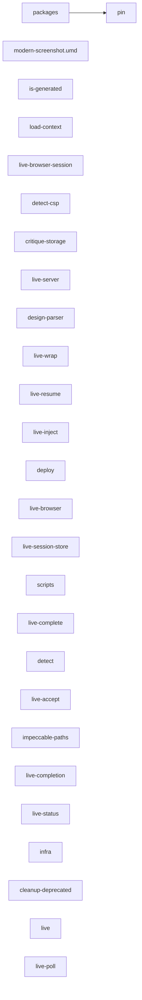

# Code atlas pack — experience-integration

Short local map for this repo. The full founder/engineer atlas lives in the L1–L6 workspace.

- Workspace index: [../../docs/atlas/START-HERE.md](../../docs/atlas/START-HERE.md)
- Layer guide: [../../docs/atlas/layers/L6.md](../../docs/atlas/layers/L6.md)
- Interactive HTML (workspace): [../../docs/atlas/raw/l6/architecture.html](../../docs/atlas/raw/l6/architecture.html)

## What this repo is

See the repo root [README.md](../../README.md).

## Local coarse Mermaid (from workspace repoarch extract)

## Wired vs dark

Open the layer guide linked above for flags and runtime gates that apply to this layer.
For L3 detectors specifically, see the workspace [REGISTRY.md](../../docs/atlas/l3/REGISTRY.md).
For L4 agent terminals (emit / withhold / abstain), see [AGENT.md](../../docs/atlas/l4/AGENT.md).
